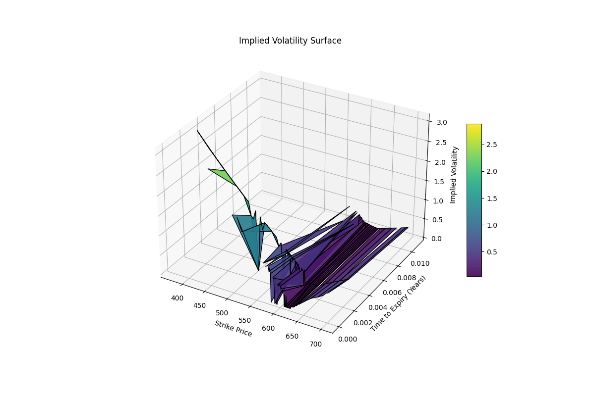

# 🧠 Volatility Surface Construction & Arbitrage Detection

This project uses real market option data to construct an implied volatility surface and detect arbitrage violations based on well-established financial principles. It demonstrates practical knowledge of options pricing, volatility modeling, and quantitative analysis using Python.

---

## 🚀 Features

- ✅ Live SPY option chain extraction using `yfinance`
- 📈 Implied volatility calculation using the Black-Scholes model
- 🔍 Detection of:
  - 🦋 Butterfly arbitrage (strike-wise convexity violation)
  - 📅 Calendar arbitrage (term structure violation)
  - ⚖ Put-call parity arbitrage (pricing inconsistency)
- 🌐 Volatility surface visualization in 3D
- 💡 Realistic data cleaning and handling of illiquid options

---

## 📊 Volatility Surface Preview



---

## 🧠 Financial Concepts Applied

- **Black-Scholes model** (European call/put pricing)
- **Brent root-finding method** for implied volatility
- **Put-call parity**:
  \[
  C - P = S - K e^{-rT}
  \]
- **Butterfly arbitrage**:
  \[
  C(K_1) - 2C(K_2) + C(K_3) \geq 0
  \]
- **Calendar arbitrage**:
  \[
  C(K, T_1) \leq C(K, T_2) \quad \text{if } T_1 < T_2
  \]

---

## 📦 Libraries Used

- `yfinance` – market data extraction
- `pandas`, `numpy` – data handling
- `matplotlib` – surface visualization
- `scipy` – optimization (Brent's method)

---

## 🧪 How to Run

1. Install required packages:
   ```bash
   pip install yfinance pandas numpy matplotlib scipy
